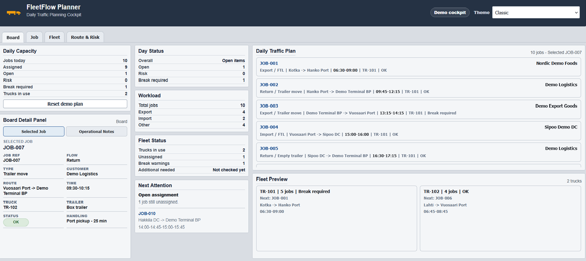
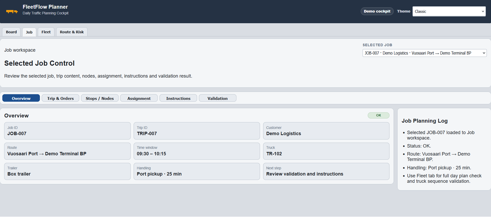
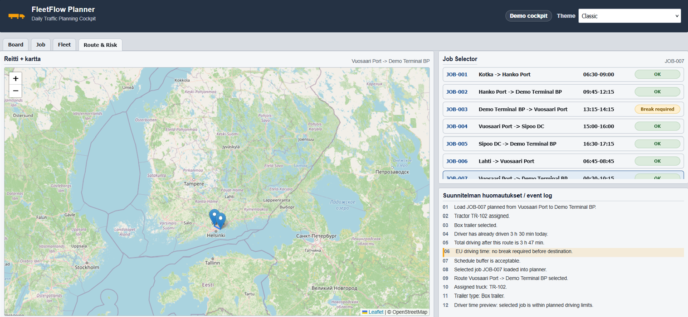

# 🚚 FleetFlow Planner

FleetFlow Planner is a React-based Transport Management System (TMS) planning dashboard developed as a portfolio project to demonstrate modern transport planning, fleet coordination and operational decision support.

The application combines practical logistics expertise with modern web technologies, providing a TMS-inspired planning cockpit for managing daily transport operations using realistic fictional demo data.

Designed and developed to showcase user-centred interface design, transport planning workflows and logistics process visualisation.

---

# 🏗️ Architecture

```text
React
      │
JavaScript
      │
Leaflet Maps
      │
Fleet Planning Dashboard
```

---

# 📸 Screenshots

| Dashboard | Job Workspace |
|-----------|---------------|
|  |  |

| Fleet | Route & Risk |
|--------|--------------|
|  |  |

---

# ⚡ Key Features

- 🚚 Daily Transport Planning Board
- 📋 Job Workspace
- 🚛 Fleet Timeline
- 🗺️ Route & Risk Map
- ⚠️ Operational Validation
- ⏱️ EU Driving Time Logic
- 🎨 Multiple UI Themes

---

# ✨ Features

## 🚚 Daily Planning Dashboard

The Dashboard provides an operational overview of the current transport plan.

Features include:

- Daily workload overview
- Capacity monitoring
- Fleet utilisation
- Selected job preview
- Planning status
- Operational summary

---

## 📋 Job Workspace

The Job Workspace follows the workflow of a modern Transport Management System.

Available sections include:

- Overview
- Trip & Orders
- Stops / Nodes
- Assignment
- Instructions
- Validation

The workspace is designed to guide planners through the complete transport planning process.

---

## 🚛 Fleet Timeline

Fleet View visualises truck-specific work sequences.

Features include:

- Vehicle workload
- Sequential jobs
- Assignment overview
- Planning validation
- Fleet utilisation

---

## 🗺️ Route & Risk

The Route & Risk view combines map visualisation with operational information.

Features include:

- Interactive Leaflet map
- Route overview
- Operational notes
- Planning risks
- Validation warnings

---

## ⚠️ Operational Planning

FleetFlow demonstrates practical transport planning concepts including:

- Capacity planning
- Fleet coordination
- Job sequencing
- Assignment workflow
- Operational validation
- Planning visibility

The application uses fictional demonstration data only.

---

# 🛠️ Tech Stack

| Layer | Technology |
|--------|------------|
| Frontend | React |
| Language | JavaScript |
| Build Tool | Vite |
| Mapping | Leaflet & React-Leaflet |
| Styling | CSS |

---

# 🚀 Getting Started

## Prerequisites

- Node.js 16+
- npm

## Installation

Clone the repository:

```bash
git clone https://github.com/Vode72/fleetflow-planner.git
```

Open the project:

```bash
cd fleetflow-planner
```

Install dependencies:

```bash
npm install
```

Run development server:

```bash
npm run dev
```

Development server:

```text
http://localhost:5173
```

Build production version:

```bash
npm run build
```

---

# 📁 Project Structure

```text
fleetflow-planner/

├── docs/
├── images/
├── public/
├── src/
├── FLEETFLOW_PLANNER_KONTEKSTI/
├── package.json
└── README.md
```

---

# 🗺️ Roadmap

## Completed ✅

- Daily Planning Dashboard
- Job Workspace
- Fleet Timeline
- Route & Risk View
- Interactive Map
- Planning Validation
- EU Driving Time Logic
- Multiple UI Themes

## Planned 🔲

- Drag & Drop Planning
- Driver Calendar
- Trailer Pool Management
- Advanced Planning Validation
- KPI Dashboard
- Planning Analytics
- Resource Optimisation
- Export Functions

---

# 🎯 Project Purpose

FleetFlow Planner demonstrates how modern transport planning software can support logistics operations through intuitive user interfaces and structured workflows.

The project focuses on operational planning rather than transport execution, helping planners visualise workload, assignments, fleet usage and route risks in a single planning environment.

---

# 👨‍💻 Author

Built by Toni Voutilainen.

FleetFlow Planner combines practical experience in transport coordination with modern web development to demonstrate how logistics expertise can be transformed into intuitive planning software.

Developed with React, JavaScript, Leaflet and Vite as part of a professional software development portfolio.