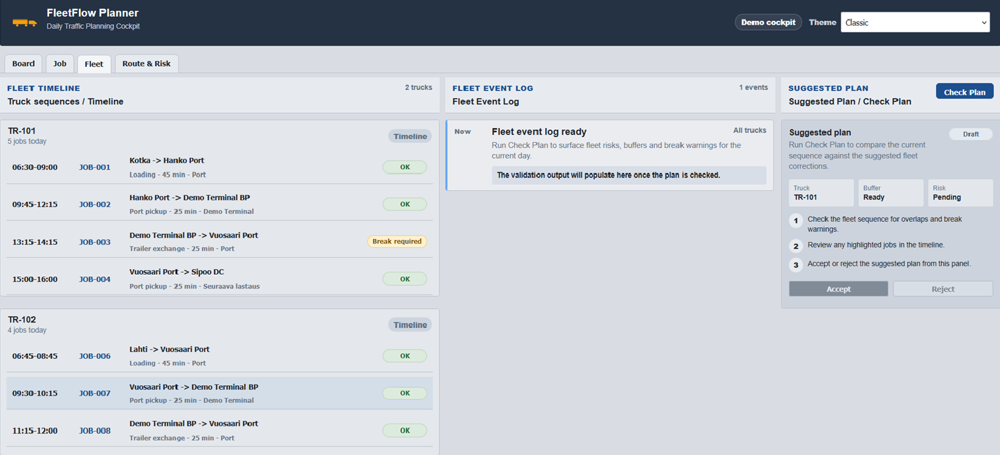

# FleetFlow Planner

FleetFlow Planner is a portfolio TMS-style planning cockpit for daily transport coordination, fleet sequencing and operational risk review.

## Screenshots

### Board — Daily Traffic Planning Cockpit

The Board view gives a quick operational overview of the day: capacity, workload, fleet status, daily traffic plan, selected job and fleet preview.

### Job — Job Workspace

The Job workspace shows the selected job in a TMS-inspired working view with internal tabs for Overview, Trip & Orders, Stops / Nodes, Assignment, Instructions and Validation.

### Fleet — Truck Sequences

The Fleet view shows truck-specific job sequences and prepares the plan validation workflow for checking whether the current plan is feasible.

### Route & Risk — Map and Operational Log

The Route & Risk view shows the selected job route, map context, route notes and operational warnings.

## Features

- Daily planning board with capacity, workload and fleet status.
- Job workspace with TMS-style internal tabs.
- Fleet timeline for truck-specific job sequences.
- Route visualization with Leaflet map context.
- Operational risk and validation preview.
- Basic EU driving time and break requirement logic.
- Multiple UI themes: classic, SAP Light and dark.

## Tech Stack

- React (Vite)
- JavaScript
- Leaflet and React-Leaflet
- CSS

## Purpose

This project demonstrates:

- UI/UX design for transport planning and TMS-style workflows.
- Practical logistics planning concepts using fictional demo data.
- Route, capacity, assignment and validation views in a single planning cockpit.

---

Built as part of portfolio development.
