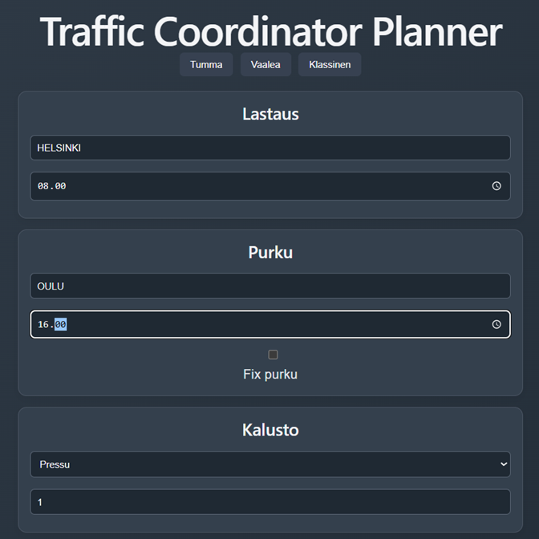
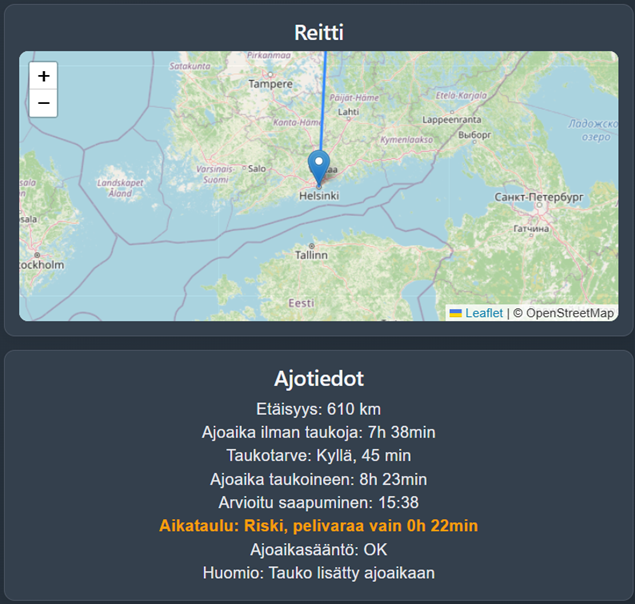

# Traffic Coordinator Planner

Logistics planning tool for transport coordinators.

## Screenshots

### Dark theme

### Classic theme

## Features

- Load & Unload planning
- Trailer selection
- Route visualization (Leaflet map)
- Distance & driving time calculation
- Estimated arrival time
- Schedule evaluation (OK / Risk / Late)
- EU driving time rules (basic logic)
- Multiple UI themes (dark / light / classic)

## Example

- Helsinki → Tampere
- Distance: 180 km
- Driving time: ~2h 15min
- Arrival time calculated automatically
- Schedule evaluation based on time windows

## Tech Stack

- React (Vite)
- JavaScript
- Leaflet (maps)
- CSS

## Purpose

This project demonstrates:
- Real-world logistics planning logic
- UI/UX design for transport planning tools
- Combining domain knowledge (logistics) with software development

---

Built as part of portfolio development.